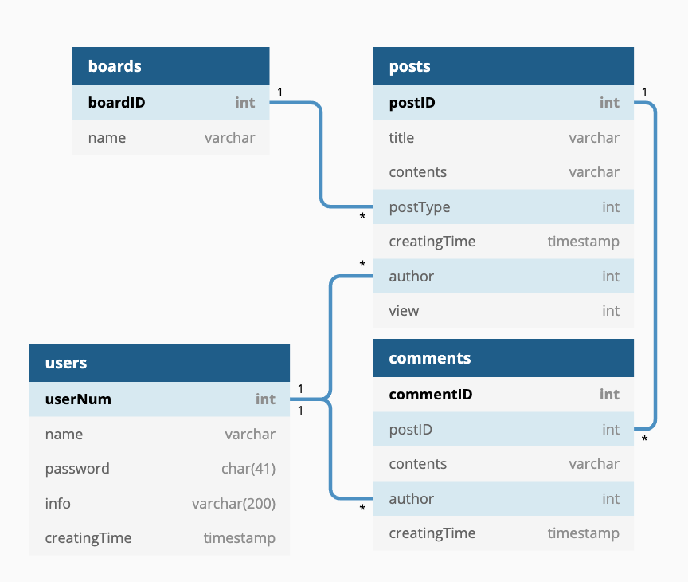
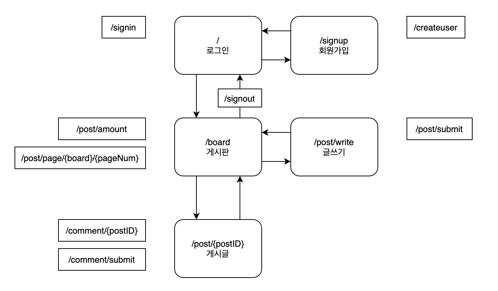

# [GrassZone]

## 정보

- java : OpenJDK 11.0.9
- gradle : 6.7.1
- spring : 5.3.2
- spring-boot : 2.4.1

## 의존성

- thymeleaf (템플릿 엔진)
- lombok (DTO의 기본적인 함수 자동 생성)
- webMVC (컨트롤러를 쓸 수 있게 해줌)
- myBatis (쿼리를 전송하고 결과값을 DTO에 매핑시켜줌)
- maria jdbc (mariaDB에 접근하기 위한 jdbc)

## 구현 기능

- 로그인
- 회원가입
- 게시판 (게시판 분류, 페이징)
- 글쓰기
- 게시글 보기
- 댓글 달기

## 구현 설명

### 데이터베이스 구조

### 서비스 흐름도

### / (메인 페이지)
- 로그인하기 `/signin`
    1. 아이디, 패스워드를 POST로 전송
    1. 서버에서 DB확인 후 성공이면 UserDTO를 세션에 저장
    1. 결과를 전송
    1. 성공이면 `/board`로 이동, 실패면 실패 알림
- 회원가입 페이지로 이동
    1. `/signup`으로 이동

### /signup (회원가입 페이지)
- 회원가입하기 `/createuser`
    1. 아이디, 패스워드, 패스워드확인을 입력
    1. 패스워드, 패스워드확인이 같은지 확인
    1. 아이디, 패스워드를 POST로 전송
    1. 서버에서 DB확인 후 결과 전송
    1. 성공이면 성공 알림 후 `/`로 이동
    1. 아이디 중복이면 알림

### /board (게시판 페이지)
- 글쓰기 페이지로 이동
    1. `/post/write`로 이동
- 로그아웃하기 `/signout`
    1. 세션 데이터 제거 후 `/`로 이동
- 게시글 보기 `/post/page/{board}/{pageNum}`
    1. 한페이지에 게시글 갯수를 GET으로 전송
    1. 서버에서 게시판분류, 페이지번호, 한페이지게시글수를 기준으로 DB 조회 후 결과 전송 (html 형식)
    1. 받은 데이터를 페이지에 추가
- 페이지 네비게이션 `/post/amount`
    1. 게시판분류를 GET으로 전송
    1. 서버에서 해당 게시판의 게시글 수를 DB에서 조회해 전송
    1. 받은 데이터를 통해 페이지 수를 계산
    1. 페이지 생성

사용 예시
- 게시판 클릭
    1. 기존 게시글 삭제
    1. `게시글 보기`기능 수행
    1. 페이지 네비게이션 삭제
    1. `페이지 네비게이션`기능 수행
- 페이지 클릭
    1. 기존 게시글 삭제
    1. `게시글 보기`기능 수행

### /post/write (글쓰기 페이지)
- 글쓰기 `/post/submit`
    1. 게시판분류, 제목, 본문을 POST로 전송
    1. DB에 데이터 추가
    1. 결과 전송
    1. 성공이면 알림 후 `/board`로 이동, 실패면 알림

### /post/{postID} (게시글 보기 페이지)
- 댓글 보기 `/comment/{postID}`
    1. GET으로 서버에 댓글데이터 요청
    1. 서버가 댓글데이터를 가져와 전송 (html 형식)
    1. 받은 데이터를 페이지에 추가
- 댓글 달기 `/comment/submit`
    1. 댓글 내용을 POST로 전송
    1. 서버에서 댓글 내용을 DB에 추가
    1. 기존 댓글 내용 전부 삭제
    1. `댓글 보기` 기능 수행

----
### 로그인 확인을 위한 인터셉터
- 문제 : 모든 게시판 기능 컨트롤러에서 세션을 확인하는 코드 추가해야 함
- 변경 : 인터셉터에서 게시판 기능 url에 대해 세션 확인

url패턴을 깔끔하게 적기위해 url변경작업을 해야 했다.

----
### 캐시 컨트롤을 위한 필터
- 문제 : 로그아웃 후에도 뒤로가기를 하면 캐시가 남아 게시판을 볼 수 있음
- 변경 : 필터에서 게시판 기능 url의 응답에 캐시컨트롤 헤더 추가

필터의 url패턴이 안먹혀서 모든 헤더에 추가되는 문제가 생겼다.

----
### 비동기 페이지에서 뒤로가기 구현
- 문제 : 페이지 기능을 비동기로 구현하니 히스토리에 쌓이지 않음
- 변경 : 페이지 기능에서 history pushstate를 추가, 뒤로가기 이벤트 핸들러를 통해 페이지 갱신

## 더 해볼 것, 개선할 것

- 카피인 캐시 알아보기
- 레디스를 이용한 캐시 서버
- 데이터 베이스 인덱스 설정
- 웹 소켓을 이용한 기능
